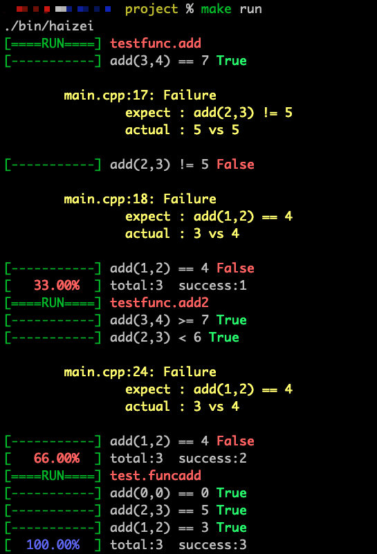

# 1、目录及文件说明

- bin/：存放编译好后的可执行文件
- googletest/：是GTest的源码
- haizei/：自己编写的头文件及对应定义的源文件
- main.cpp: 替换头文件为<gtest/gtest.h> 可以运行GTest测试框架，当前的程序是使用的自己编写的测试框架

# 2、编译及运行

```shell
make #编译
make run #运行
```

# 3、运行效果截图

